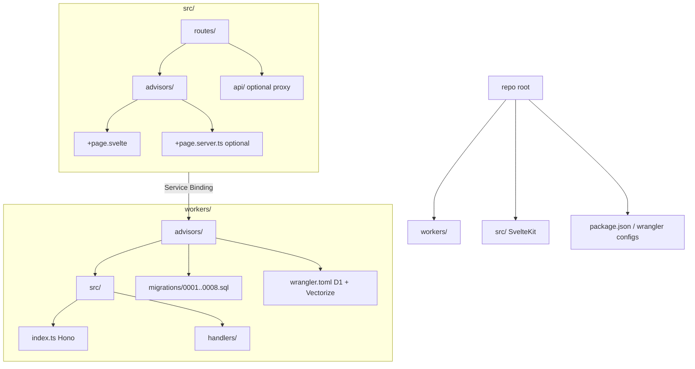

# Advisors CF v2



```zsh

curl -X GET "https://app.marsdd.com/api/advisors-query?query=who%20can%20write%20a%20pitch%20deck" \
  -H "X-API-Advisor-Key: 72..." \
  -H "Content-Type: application/json"

```
