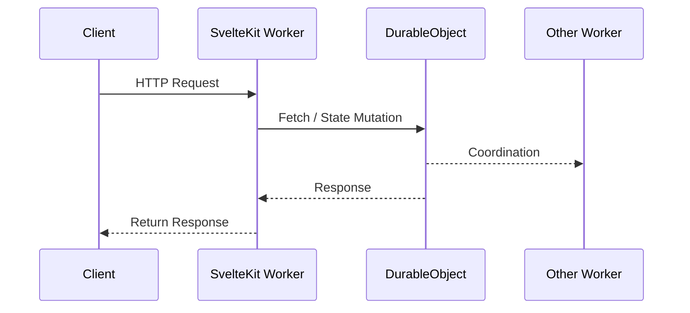

# Running Durable Objects on Localhost

Durable Objects **can run on localhost**, but you need to follow a few rules to make sure everything works smoothly.

## Rules

1. **Start each Worker independently**

   * Use `wrangler dev` (or equivalent) for every Worker that participates in the system.

2. **Check connectivity**

   * Confirm in the console that each Worker is connected and that Durable Objects are properly bound.

3. **SvelteKit Application (Main Worker)**

   * Since the app is bundled into a Worker, you must run:

     ```bash
     pnpm build
     ```

     after every code change if you want to see the updates **integrated with other Workers**.
   * You *can* run `pnpm dev` for faster iteration, but this will **not integrate properly with other Workers** the way `wrangler dev` does.

---

## Sequence Example



---

✅ **Summary**

* Start all Workers with `wrangler dev`
* Use `pnpm build` for SvelteKit to ensure integration
* `pnpm dev` is fine for local-only iteration, but not for multi-Worker integration

```zsh

# Terminal 1: Start DO worker
cd workers/dexp-company-tags
wrangler dev --port 8788 --local

# Terminal 2: Start main app
pnpm build && wrangler dev --port 8787 --local --env dev

# Terminal 3: Trigger sync
# a.s. won't work due to a security!
curl -X POST http://localhost:8788/sync-now

```
